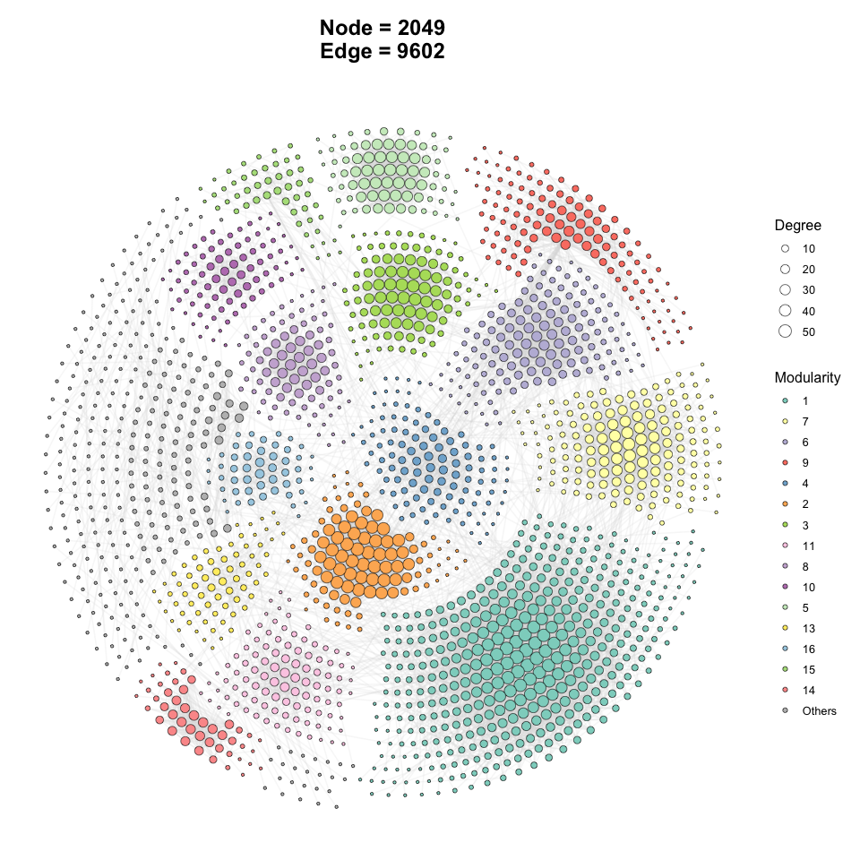
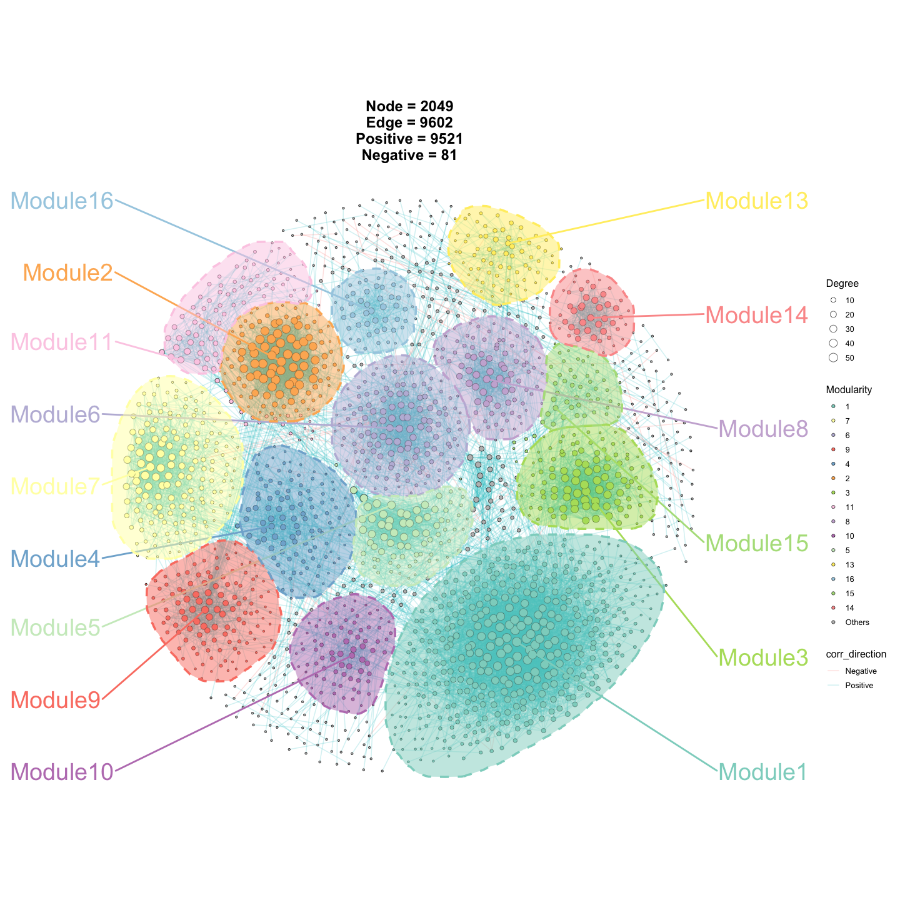
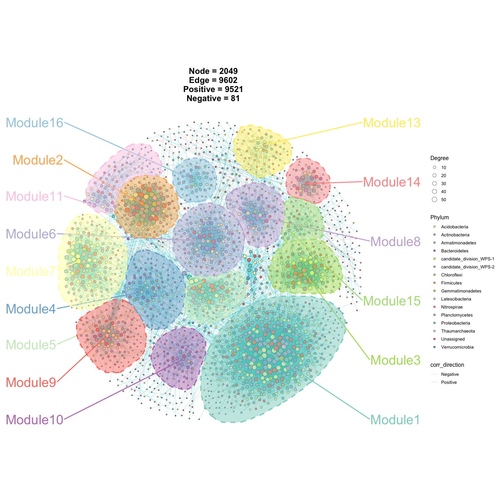

<!-- README.md is generated from README.Rmd. Please edit that file -->

# ggNetView 

<!-- badges: start -->

<!-- badges: end -->

ggNetView is an R package for network analysis and visualization. It
provides flexible and publication-ready tools for exploring complex
biological and ecological networks.

</br> </br> </br>

## Installation

You can install the development version of ggNetView from
[GitHub](https://github.com/) with:

    # install.packages("devtools")
    devtools::install_github("Jiawang1209/ggNetView")

or

    # install.packages("pak")
    pak::pak("Jiawang1209/ggNetView")

## Example1

### Step1: load ggNetView

``` r
library(ggNetView)
#> 
#>                                                ░██               ░██
#>                                                ░██
#>  ░████████  ░████████ ░████████   ░███████  ░████████ ░██    ░██ ░██ ░███████  ░██    ░██    ░██
#> ░██    ░██ ░██    ░██ ░██    ░██ ░██    ░██    ░██    ░██    ░██ ░██░██    ░██ ░██    ░██    ░██
#> ░██    ░██ ░██    ░██ ░██    ░██ ░█████████    ░██     ░██  ░██  ░██░█████████  ░██  ░████  ░██
#> ░██   ░███ ░██   ░███ ░██    ░██ ░██           ░██      ░██░██   ░██░██          ░██░██ ░██░██
#>  ░█████░██  ░█████░██ ░██    ░██  ░███████      ░████    ░███    ░██ ░███████     ░███   ░███
#>        ░██        ░██
#>  ░███████   ░███████
#> 
#> 
#>   ggNetView v1.1.1 (2026)
#>   Developed by Jiawang's Network Visualization Group
#> 
#>   Maintainers:
#>    - Yue Liu <yueliu@iae.ac.cn>
#>    - Chao Wang <cwang@iae.ac.cn>
#> 
#>   GitHub: https://github.com/Jiawang1209/ggNetView
#>   Bug Reports: https://github.com/Jiawang1209/ggNetView/issues
#> 
#>   Type citation('ggNetView') for how to cite this package.
#>   Run browseVignettes('ggNetView') for documentation.
#> 
library(ggplot2)
#> Warning: package 'ggplot2' was built under R version 4.5.2
library(ggnewscale)
```

### Step2: load Data

> You can load raw matrix

``` r
data("otu_tab")

otu_tab[1:5, 1:5]
#>        KO1  KO2  KO3  KO4  KO5
#> ASV_1 1113 1968  816 1372 1062
#> ASV_2 1922 1227 2355 2218 2885
#> ASV_3  568  460  899  902 1226
#> ASV_4 1433  400  535  759 1287
#> ASV_6  882  673  819  888 1475
```

> You can load rarely matrix

``` r
data("otu_rare")

otu_tab[1:5, 1:5]
#>        KO1  KO2  KO3  KO4  KO5
#> ASV_1 1113 1968  816 1372 1062
#> ASV_2 1922 1227 2355 2218 2885
#> ASV_3  568  460  899  902 1226
#> ASV_4 1433  400  535  759 1287
#> ASV_6  882  673  819  888 1475
```

> 

``` r
data("otu_rare_relative")

otu_rare_relative[1:5, 1:5]
#>              KO1        KO2        KO3        KO4        KO5
#> ASV_1 0.03306667 0.05453333 0.02013333 0.03613333 0.02686667
#> ASV_2 0.05750000 0.03393333 0.06046667 0.05810000 0.07320000
#> ASV_3 0.01733333 0.01296667 0.02290000 0.02336667 0.03106667
#> ASV_4 0.04266667 0.01093333 0.01416667 0.01933333 0.03346667
#> ASV_6 0.02646667 0.01856667 0.02110000 0.02353333 0.03806667
```

> You can load node annotation

``` r
data("tax_tab")

tax_tab[1:5, 1:5]
#> # A tibble: 5 × 5
#>   OTUID  Kingdom  Phylum          Class          Order            
#>   <chr>  <chr>    <chr>           <chr>          <chr>            
#> 1 ASV_2  Archaea  Thaumarchaeota  Unassigned     Nitrososphaerales
#> 2 ASV_3  Bacteria Verrucomicrobia Spartobacteria Unassigned       
#> 3 ASV_31 Bacteria Actinobacteria  Actinobacteria Actinomycetales  
#> 4 ASV_27 Archaea  Thaumarchaeota  Unassigned     Nitrososphaerales
#> 5 ASV_9  Bacteria Unassigned      Unassigned     Unassigned
```

### Step3: create graph object

``` r
obj <- build_graph_from_mat(
  mat = otu_rare_relative,
  transfrom.method = "none",
  method = "WGCNA",
  cor.method = "pearson",
  proc = "BH",
  r.threshold = 0.7,
  p.threshold = 0.05,
  node_annotation = tax_tab
)
#> 
```

### Step4: ggNetView to plot

``` r
p1 <- ggNetView(
  graph_obj = obj,
  layout = "gephi",
  layout.module = "adjacent",
  group.by = "Modularity",
  fill.by = "Modularity",
  pointsize = c(1, 5),
  center = F,
  jitter = F,
  mapping_line = F,
  shrink = 0.9,
  linealpha = 0.2,
  linecolor = "#d9d9d9"
) 

p1
```



``` r
p2 <- ggNetView(
  graph_obj = obj,
  layout = "gephi",
  layout.module = "random",
  group.by = "Modularity",
  fill.by = "Modularity",
  pointsize = c(1, 5),
  center = F,
  jitter = TRUE,
  jitter_sd = 0.15,
  mapping_line = TRUE,
  shrink = 0.9,
  linealpha = 0.2,
  linecolor = "#d9d9d9",
  add_outer = T,
  label = T
) 
#> Large array (1004 rows x 997 columns x 17 images) broken into 4 pieces to avoid memory limits
#> Each piece of the raster consists of 710 rows and 705 columns
#> Coordinate system already present.
#> ℹ Adding new coordinate system, which will replace the existing one.

p2
#> Warning: No shared levels found between `names(values)` of the manual scale and the
#> data's fill values.
```



``` r
p3 <- ggNetView(
  graph_obj = obj,
  layout = "gephi",
  layout.module = "random",
  group.by = "Modularity",
  fill.by = "Phylum",
  pointsize = c(1, 5),
  center = F,
  jitter = TRUE,
  jitter_sd = 0.15,
  mapping_line = TRUE,
  shrink = 0.9,
  linealpha = 0.2,
  linecolor = "#d9d9d9",
  add_outer = T,
  label = T
) 
#> Large array (1004 rows x 997 columns x 17 images) broken into 4 pieces to avoid memory limits
#> Each piece of the raster consists of 710 rows and 705 columns
#> Coordinate system already present.
#> ℹ Adding new coordinate system, which will replace the existing one.

p3
#> Warning: No shared levels found between `names(values)` of the manual scale and the
#> data's fill values.
```



### Step5: save plot

    ggsave(file = "Output/p1.pdf",
           plot = p1,
           height = 10,
           width = 10)


    ggsave(file = "Output/p2.pdf",
           plot = p2,
           height = 10,
           width = 10)
           
    ggsave(file = "Output/p3.pdf",
           plot = p3,
           height = 10,
           width = 10)

## Example2

``` r
# load test data in ggNetView
data("Envdf_4st")
data("Spedf")
```

``` r
out1 <- gglink_heatmaps(
  env = Envdf_4st,
  spec = Spedf,
  env_select = list(Env01 = 1:14,
                    Env02 = 15:28,
                    Env03 = 29:42,
                    Env04 = 43:56),
  spec_select = list(Spec01 = 1:8),
  relation_method = "correlation",
  spec_layout = "circle_outline",
  cor.method = "pearson",
  cor.use = "pairwise",
  r = 6,
  orientation = c("top_right", "bottom_right", "top_left", "bottom_left")
)
#> The max module in network is 2 we use the 2  modules for next analysis

out1[[1]]
```


## Example3

``` r
out2 <- gglink_heatmaps(
  env = Envdf_4st,
  spec = Spedf,
  env_select = list(Env01 = 1:14,
                    Env03 = 29:40,
                    Env04 = 43:50),
  spec_select = list(Spec01 = 1:8),
  relation_method = "correlation",
  spec_layout = "circle_outline",
  cor.method = "pearson",
  cor.use = "pairwise",
  r = 6,
  orientation = c("top_right", "top_left", "bottom_left")
)
#> The max module in network is 2 we use the 2  modules for next analysis

out2[[2]]
```


## sessionInfo

``` r
sessionInfo()
#> R version 4.5.1 (2025-06-13)
#> Platform: aarch64-apple-darwin20
#> Running under: macOS Sequoia 15.6
#> 
#> Matrix products: default
#> BLAS:   /Library/Frameworks/R.framework/Versions/4.5-arm64/Resources/lib/libRblas.0.dylib 
#> LAPACK: /Library/Frameworks/R.framework/Versions/4.5-arm64/Resources/lib/libRlapack.dylib;  LAPACK version 3.12.1
#> 
#> locale:
#> [1] en_US.UTF-8/en_US.UTF-8/en_US.UTF-8/C/en_US.UTF-8/en_US.UTF-8
#> 
#> time zone: Asia/Shanghai
#> tzcode source: internal
#> 
#> attached base packages:
#> [1] stats     graphics  grDevices utils     datasets  methods   base     
#> 
#> other attached packages:
#> [1] ggnewscale_0.5.2 ggplot2_4.0.1    ggNetView_1.1.1 
#> 
#> loaded via a namespace (and not attached):
#>   [1] mnormt_2.1.1           DBI_1.2.3              deldir_2.0-4          
#>   [4] gridExtra_2.3          rlang_1.1.6            magrittr_2.0.4        
#>   [7] otel_0.2.0             spatstat.geom_3.6-1    matrixStats_1.5.0     
#>  [10] compiler_4.5.1         RSQLite_2.4.5          png_0.1-8             
#>  [13] vctrs_0.6.5            stringr_1.6.0          pkgconfig_2.0.3       
#>  [16] crayon_1.5.3           fastmap_1.2.0          backports_1.5.0       
#>  [19] XVector_0.50.0         labeling_0.4.3         ggraph_2.2.2          
#>  [22] utf8_1.2.6             rmarkdown_2.30         preprocessCore_1.70.0 
#>  [25] purrr_1.2.0            bit_4.6.0              xfun_0.55             
#>  [28] cachem_1.1.0           goftest_1.2-3          blob_1.2.4            
#>  [31] spatstat.utils_3.2-0   tweenr_2.0.3           psych_2.5.6           
#>  [34] parallel_4.5.1         cluster_2.1.8.1        R6_2.6.1              
#>  [37] spatstat.data_3.1-9    stringi_1.8.7          RColorBrewer_1.1-3    
#>  [40] spatstat.univar_3.1-5  rpart_4.1.24           Rcpp_1.1.0            
#>  [43] Seqinfo_1.0.0          iterators_1.0.14       knitr_1.51            
#>  [46] tensor_1.5.1           WGCNA_1.73             base64enc_0.1-3       
#>  [49] IRanges_2.44.0         FNN_1.1.4.1            Matrix_1.7-4          
#>  [52] splines_4.5.1          nnet_7.3-20            igraph_2.2.1          
#>  [55] tidyselect_1.2.1       abind_1.4-8            rstudioapi_0.17.1     
#>  [58] dichromat_2.0-0.1      yaml_2.3.12            viridis_0.6.5         
#>  [61] spatstat.random_3.4-3  spatstat.explore_3.6-0 doParallel_1.0.17     
#>  [64] codetools_0.2-20       lattice_0.22-7         tibble_3.3.0          
#>  [67] Biobase_2.70.0         withr_3.0.2            KEGGREST_1.50.0       
#>  [70] S7_0.2.1               evaluate_1.0.5         foreign_0.8-90        
#>  [73] survival_3.8-3         polyclip_1.10-7        Biostrings_2.78.0     
#>  [76] pillar_1.11.1          checkmate_2.3.3        foreach_1.5.2         
#>  [79] stats4_4.5.1           generics_0.1.4         S4Vectors_0.48.0      
#>  [82] scales_1.4.0           glue_1.8.0             Hmisc_5.2-4           
#>  [85] tools_4.5.1            data.table_1.18.0      fastcluster_1.3.0     
#>  [88] graphlayouts_1.2.2     tidygraph_1.3.1        grid_4.5.1            
#>  [91] impute_1.82.0          tidyr_1.3.2            AnnotationDbi_1.72.0  
#>  [94] colorspace_2.1-2       nlme_3.1-168           ggforce_0.5.0         
#>  [97] htmlTable_2.4.3        Formula_1.2-5          cli_3.6.5             
#> [100] spatstat.sparse_3.1-0  mascarade_0.2.999      viridisLite_0.4.2     
#> [103] dplyr_1.1.4            gtable_0.3.6           dynamicTreeCut_1.63-1 
#> [106] digest_0.6.39          BiocGenerics_0.56.0    ggrepel_0.9.6         
#> [109] htmlwidgets_1.6.4      farver_2.1.2           memoise_2.0.1         
#> [112] htmltools_0.5.9        multtest_2.64.0        lifecycle_1.0.4       
#> [115] httr_1.4.7             GO.db_3.22.0           bit64_4.6.0-1         
#> [118] MASS_7.3-65
```

#### Citation

If you use ggNetView in your research, please cite:

    Yue Liu (2025). ggNetView: An R package for complex biological and ecological network analysis and visualization. R package version 0.1.0. 
    https://github.com/Jiawang1209/ggNetView

<h4 align="center">

©微信公众号 RPython
</h5>
